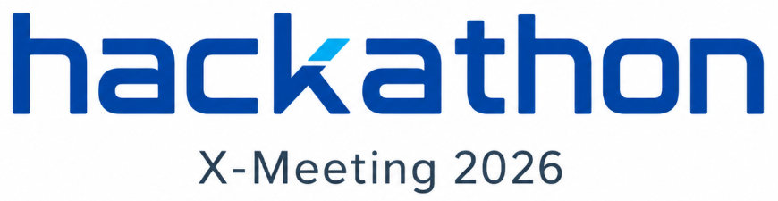
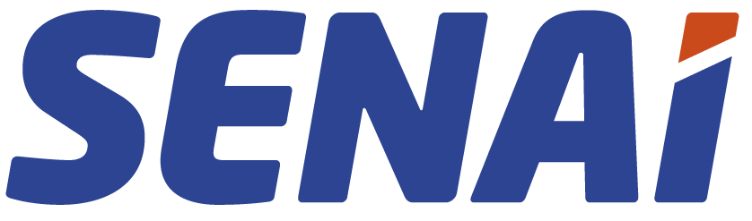

<p align="center">
  
</p>

# BovOmics Challenge - Repositório da Equipe

Hackathon de Bioinformática · **X-Meeting 2026** · 9 de junho · Garibaldi/RS — Vale dos Vinhedos
**JBS Biotech.** (empresa desafiante) · **UniSENAI/SC** · **Institutos SENAI de Inovação SC** · **AB3C**

<p align="center">
  
  
  
</p>

> Template de repositório para a equipe organizar o trabalho de forma
> **reprodutível**. A organização espelha as 4 camadas ômicas do desafio.

---

## 🐄 O desafio

A lactação bovina é um processo altamente regulado (transcrição, epigenética,
estados celulares, metabolismo). Integrar múltiplas camadas ômicas conecta essas
dimensões em uma visão sistêmica.

**Pergunta central:**

> *Como integrar diferentes camadas ômicas da glândula mamária bovina para
> identificar genes, regiões regulatórias, tipos celulares e vias biológicas
> associados à produção e à composição do leite?*

A descrição detalhada de cada camada está em [`data/README.md`](data/README.md).

| Camada | O que informa |
|---|---|
| 🧬 **RNA-seq bulk** | Genes mais/menos expressos no tecido (âncora da integração) |
| 🔬 **sc/snRNA-seq** | Quais genes são expressos em cada tipo celular |
| 📊 **ATAC-seq** | Regiões do genoma acessíveis (elementos regulatórios) |
| 🔩 **BS-seq** | Regiões com marcas de metilação de DNA |

## 📁 Estrutura

```
.
├── README.md          # este arquivo
├── .gitignore         # protege os dados (NDA)
│
├── data/              # dados do DESAFIO + README
│   ├── README.md      # descrição das 4 camadas
│   ├── rna-seq/        🧬
│   ├── scrna-seq/      🔬
│   ├── atac-seq/       📊
│   └── bs-seq/         🔩
│
├── src/               # código reprodutível (scripts, pipelines)
├── notebooks/         # análises exploratórias (Jupyter / R Markdown)
└── results/           # saídas geradas pelo código (figuras, tabelas, relatórios)
```

Três pastas de trabalho, propositalmente simples: **dado** entra em `data/`,
**código** vive em `src/` e `notebooks/`, e **saídas** vão para `results/` —
sempre regeneráveis a partir do código. Organize subpastas internas como a
equipe preferir (ex.: por camada ou por etapa de análise).

## 📨 Como enviar a solução - faça um *fork*

**Cada equipe deve fazer um _fork_ deste repositório** e desenvolver a solução no
próprio fork. A entrega oficial será o **link do repositório da equipe**, preferencialmente 
apontando para o fork criado a partir deste repositório.

1. Faça um **fork** deste repositório para a conta ou organização da equipe.
2. Faça o `git clone` do seu fork e desenvolva nele.
3. Garanta que o código roda do zero (documente o ambiente e as dependências).
4. Registre **ferramentas, versões e a motivação** de cada escolha (§07).
6. O envio deverá ser feito por e-mail para: **[hackathon.xmeeting@gmail.com](mailto:hackathon.xmeeting@gmail.com?subject=Submiss%C3%A3o%20Hackathon%20-%20%5BNome%20da%20Equipe%5D%20-%20%5BTrilha%5D)**, 
com o assunto: **“Submissão Hackathon – [Nome da Equipe] – [Trilha]”**.


## 🏁 Trilhas (Regulamento §04)

| Trilha | Entrega |
|---|---|
| **1 — Ideia / Conceito** | Proposta conceitual: problema, abordagem, resultados esperados e impacto. Sem código obrigatório. |
| **2 — Protótipo / Pipeline** | Pipeline documentado e reprodutível (dados simulados ou subconjunto). Código obrigatório. |
| **3 — Aplicação em Dataset** | Análise completa sobre os dados da JBS, com visualizações e insights em notebook reprodutível. |

## 📊 Avaliação (Regulamento §08)

| Critério | Peso |
|---|---:|
| Potencial de Aplicação | 30% |
| Rigor Científico | 25% |
| Relevância e Inovação | 15% |
| Reprodutibilidade | 15% |
| Clareza da Comunicação | 15% |

## ✅ Conduta (Regulamento §07)

Bibliotecas open-source (Seurat, Scanpy, scikit-learn, PyTorch, Bioconductor…)
são permitidas e encorajadas. IA generativa é permitida como **auxílio** e deve
ser **reportada**. Dados externos e ferramentas devem ser **documentados e
citados**. Plágio ou adulteração → desclassificação.

---

📧 Dúvidas: **fausto.lima-junior@fiesc.com.br**
*UniSENAI/SC · Institutos SENAI de Inovação SC · JBS · AB3C*
